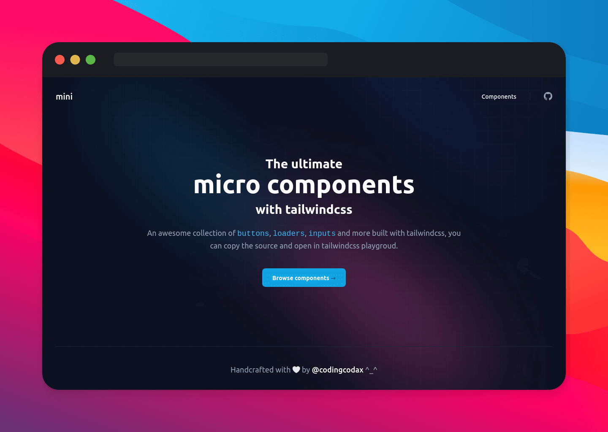
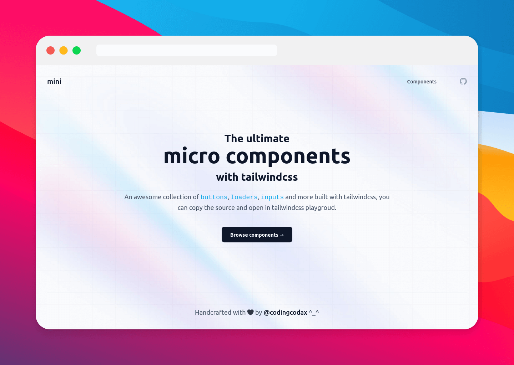
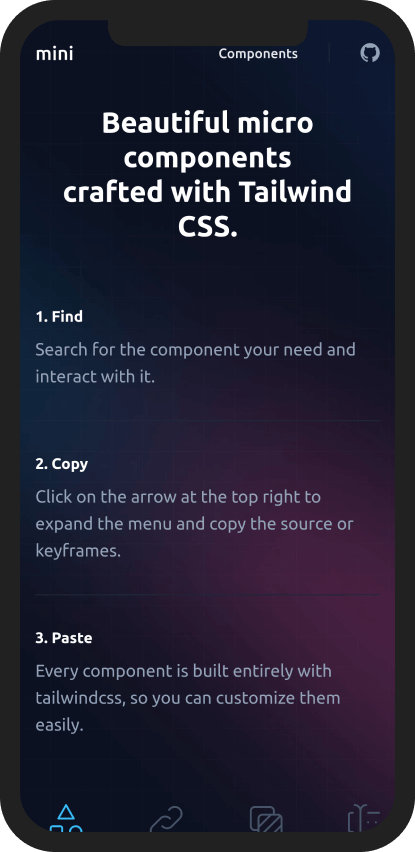
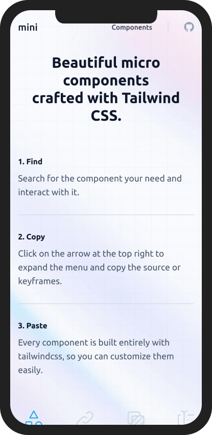

  

  <h3 align='center'>mini | tailwind snippets</h3>

  

    <samp>An awesome collection of buttons, loaders, inputs and more built with tailwindcss, you can copy the source and open in tailwindcss playgroud.</samp>
     
    <a href='https://mini.codingcodax.dev/components' rel='noopener noreferrer' target='_blank'><strong>See components</strong></a>
     
     
    <a href='https://github.com/codingcodax/mini/issues'>Feature Request</a>
    ·
    <a href='https://github.com/codingcodax/mini/issues/'>Bug Report</a>
  

## Features

- Ease copy paste.
- Code on playground.

### Techstack

This app was built with the T3 Stack:

- [Next.js](https://nextjs.org)
- [Tailwind CSS](https://tailwindcss.com)

## Gallery

### Desktop

  
Dark

  

  
Light

  

### Mobile

  
Dark

  

  
Light

  

## License

Licensed under the [MIT license](./LICENSE.md)
